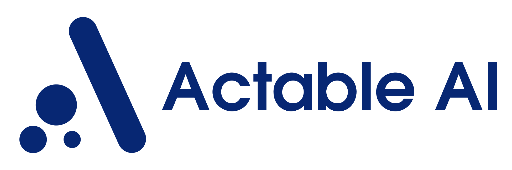

<div id="top"></div>
<!-- PROJECT SHIELDS -->

[](https://github.com/Actable-AI/actableai-lib/actions)
[](https://github.com/Actable-AI/actableai-lib/actions)


<!-- PROJECT LOGO -->
<br />
<div align="center">
  <a href="https://actable.ai">
    

  <p align="center">
    Automated Machine Learning and Data Science for everyone
    <br />
    <a href="https://google.com"><strong>Explore the docs »</strong></a>
    <br />
    <br />
    <a href="https://actable.ai">View Demo</a>
    ·
    <a href="https://github.com/othneildrew/Best-README-Template/issues">Report Bug</a>
    ·
    <a href="https://github.com/othneildrew/Best-README-Template/issues">Request Feature</a>
  </p>
</div>

[![Contributors][contributors-shield]][contributors-url]
[![Forks][forks-shield]][forks-url]
[![Stargazers][stars-shield]][stars-url]
[![Issues][issues-shield]][issues-url]
[![MIT License][license-shield]][license-url]
[![LinkedIn][linkedin-shield]][linkedin-url]

<!-- TABLE OF CONTENTS -->
<details>
  <summary>Table of Contents</summary>
  <ol>
    <li>
      <a href="#about-the-project">About The Project</a>
      <ul>
        <li><a href="#built-with">Built With</a></li>
      </ul>
    </li>
    <li>
      <a href="#getting-started">Getting Started</a>
      <ul>
        <li><a href="#prerequisites">Prerequisites</a></li>
        <li><a href="#installation">Installation</a></li>
      </ul>
    </li>
    <li><a href="#usage">Usage</a></li>
    <li><a href="#roadmap">Roadmap</a></li>
    <li><a href="#contributing">Contributing</a></li>
    <li><a href="#license">License</a></li>
    <li><a href="#contact">Contact</a></li>
    <li><a href="#acknowledgments">Acknowledgments</a></li>
  </ol>
</details>


<!-- ABOUT THE PROJECT -->
## About The Project

There are many great README templates available on GitHub; however, I didn't find one that really suited my needs so I created this enhanced one. I want to create a README template so amazing that it'll be the last one you ever need -- I think this is it.

Here's why:
* Your time should be focused on creating something amazing. A project that solves a problem and helps others
* You shouldn't be doing the same tasks over and over like creating a README from scratch
* You should implement DRY principles to the rest of your life :smile:

Of course, no one template will serve all projects since your needs may be different. So I'll be adding more in the near future. You may also suggest changes by forking this repo and creating a pull request or opening an issue. Thanks to all the people have contributed to expanding this template!

Use the `BLANK_README.md` to get started.

### Built With

* [Autogluon](https://reactjs.org/)
* [Sklearn](https://nextjs.org/)
* [Pandas](https://vuejs.org/)
* [Ray](https://angular.io/)


<!-- GETTING STARTED -->
## Getting Started

This is an example of how you may give instructions on setting up your project locally.
To get a local copy up and running follow these simple example steps.

### Prerequisites

- You need to have [python 3.7](https://www.python.org/downloads/release/python-370) installed with [pip](https://pip.pypa.io/en/stable/)
- You need to have [R](https://www.r-project.org/) installed

### Installation

```sh
pip install -r requirements.txt
```

<!-- USAGE EXAMPLES -->
## Usage

Running a classification :

```python
import pandas as pd

from actableai.tasks.classification import AAIClassificationTask

df = pd.read_csv("dataframepath.csv")

result = AAIClassificationTask(
  df,
  target='target_column'
)

```
_For more examples, please refer to the [Documentation](https://google.com)_

<!-- ROADMAP -->
## Roadmap

- [x] Add Changelog
- [x] Add back to top links
- [ ] Add Additional Templates w/ Examples
- [ ] Add "components" document to easily copy & paste sections of the readme
- [ ] Multi-language Support
    - [ ] Chinese
    - [ ] Spanish

See the [open issues](https://github.com/Actable-AI/actableai-lib/issues) for a full list of proposed features (and known issues).

<!-- CONTRIBUTING -->
## Contributing

Contributions are what make the open source community such an amazing place to learn, inspire, and create. Any contributions you make are **greatly appreciated**.

If you have a suggestion that would make this better, please fork the repo and create a pull request. You can also simply open an issue with the tag "enhancement".
Don't forget to give the project a star! Thanks again!

1. Fork the Project
2. Create your Feature Branch (`git checkout -b feature/AmazingFeature`)
3. Commit your Changes (`git commit -m 'Add some AmazingFeature'`)
4. Push to the Branch (`git push origin feature/AmazingFeature`)
5. Open a Pull Request

<!-- LICENSE -->
## License

Distributed under the Apache License. See `LICENSE.txt` for more information.

<!-- CONTACT -->
## Contact

Trung Huynh - [@Linkedin](https://www.linkedin.com/in/trunghlt/) - trung@actable.ai

Project Link: [https://github.com/Actable-AI/actableai-lib](https://github.com/Actable-AI/actableai-lib)

<!-- ACKNOWLEDGMENTS -->
## Acknowledgments

<p align="right">(<a href="#top">back to top</a>)</p>

<!-- MARKDOWN LINKS & IMAGES -->
<!-- https://www.markdownguide.org/basic-syntax/#reference-style-links -->
[contributors-shield]: https://img.shields.io/github/contributors/Actable-AI/actableai-lib.svg?style=for-the-badge
[contributors-url]: https://github.com/Actable-AI/actableai-lib/graphs/contributors
[forks-shield]: https://img.shields.io/github/forks/Actable-AI/actableai-lib.svg?style=for-the-badge
[forks-url]: https://github.com/Actable-AI/actableai-lib/network/members
[stars-shield]: https://img.shields.io/github/stars/Actable-AI/actableai-lib.svg?style=for-the-badge
[stars-url]: https://github.com/Actable-AI/actableai-lib/stargazers
[issues-shield]: https://img.shields.io/github/issues/Actable-AI/actableai-lib.svg?style=for-the-badge
[issues-url]: https://github.com/Actable-AI/actableai-lib/issues
[license-shield]: https://img.shields.io/github/license/Actable-AI/actableai-lib.svg?style=for-the-badge
[license-url]: https://github.com/Actable-AI/actableai-lib/blob/master/LICENSE.txt
[linkedin-shield]: https://img.shields.io/badge/-LinkedIn-black.svg?style=for-the-badge&logo=linkedin&colorB=555
[linkedin-url]: https://www.linkedin.com/company/actable-ai
[product-screenshot]: images/screenshot.png
